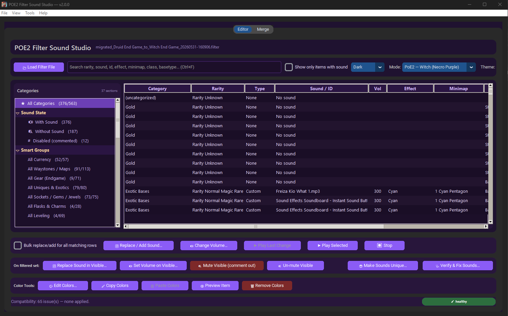
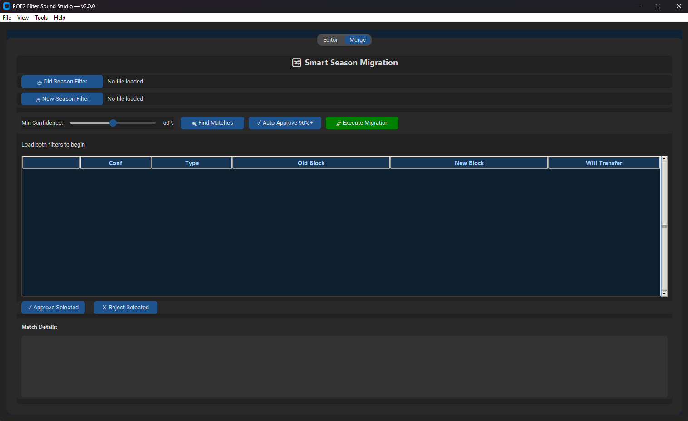
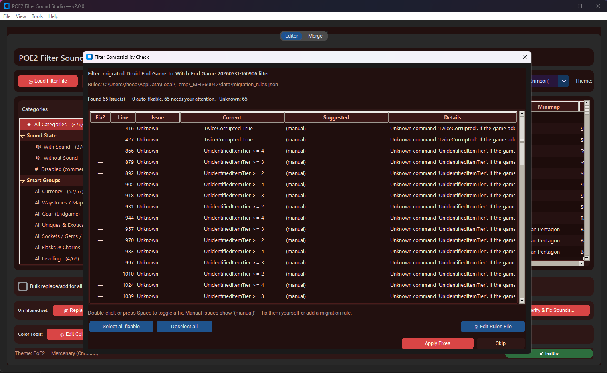
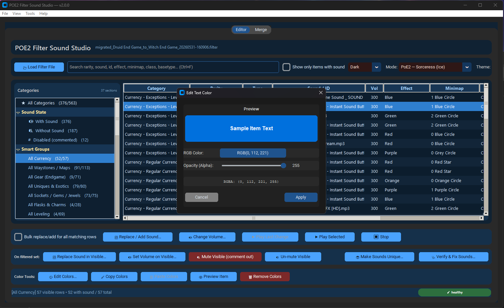
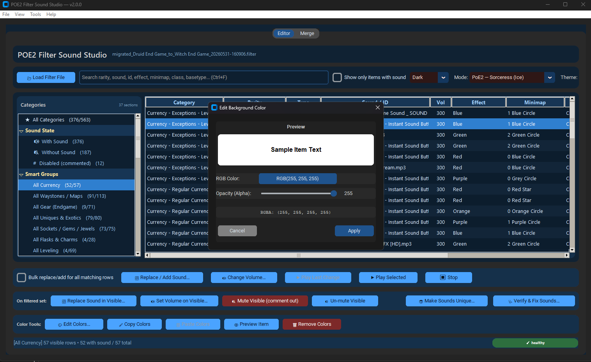
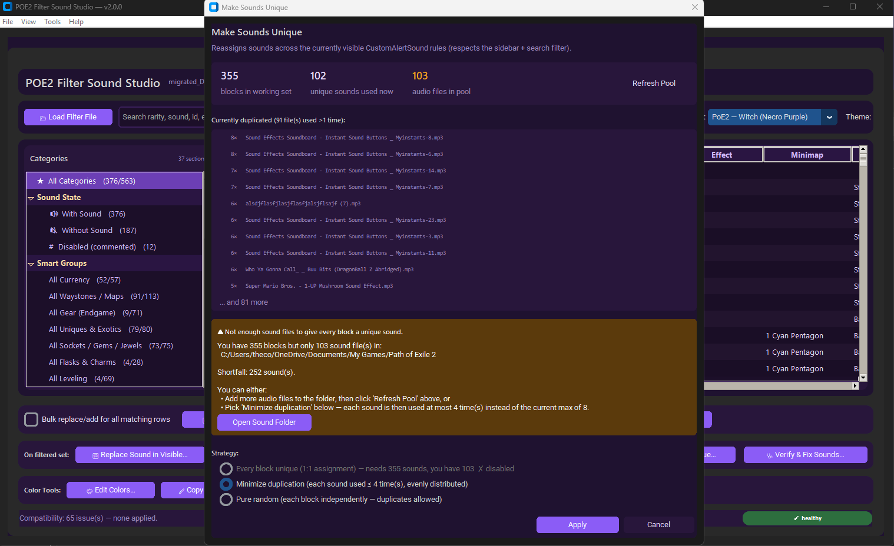
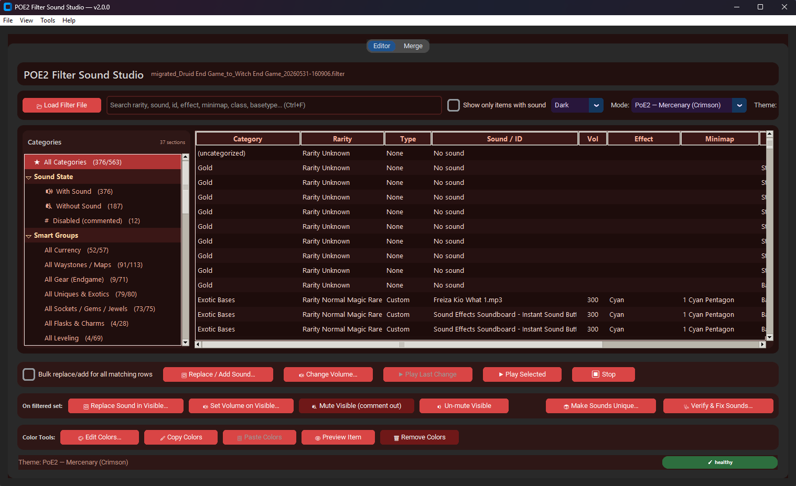

# POE2 Filter Sound Studio

POE2 Filter Sound Studio is a desktop tool for editing Path of Exile 2
`.filter` files. It focuses on custom alert sounds, volume changes, sound-file
health checks, color rules, and season-to-season sound migration.



> **Want the standalone Windows EXE?** Grab `App_v3.exe` from the
> [Releases page](https://github.com/xtheredshirtx/poe2-filter-sound-studio/releases)
> — no Python install required, FFmpeg bundled.

The current source entry point is `main.py`.

App identity in code:

- Name: `POE2 Filter Sound Studio`
- Version: `2.0.0`
- Main UI framework: `customtkinter` plus standard `tkinter`

## Screenshots

| Smart Season Migration | Filter Compatibility Check |
| :-: | :-: |
|  |  |
| Transfer custom sounds from an old season filter to a new one via fuzzy matching. | Spot unknown commands and outdated rules; apply migration rules in bulk. |

| Edit Text Color | Edit Background Color |
| :-: | :-: |
|  |  |
| RGBA picker with live preview of `SetTextColor`. | Same for `SetBackgroundColor`; alpha slider included. |

| Make Sounds Unique | Mercenary (Crimson) Theme |
| :-: | :-: |
|  |  |
| Distribute available sound files across visible blocks (1:1, balanced, or random). | Built-in palettes per POE2 class — switch live from the Mode dropdown. |

## What This Tool Does

- Loads POE2 `.filter` files and parses their `Show` and `Hide` blocks.
- Shows each block in a searchable table with category, rarity, sound, volume,
  effects, minimap icons, and item context.
- Replaces, adds, mutes, unmutes, and bulk-edits filter sound rules.
- Copies selected sound files into the same folder as the loaded filter.
- Previews custom sound files through several possible audio backends.
- Edits `SetTextColor`, `SetBorderColor`, and `SetBackgroundColor` rules with an
  RGBA color picker.
- Restyles the whole filter by **economy value tier** (SS → F), with an editable
  per-tier style editor and named presets.
- Sets **one drop sound for every item in a value tier** at once.
- Tracks missing and unused sound files in the filter folder.
- Migrates sounds from an old season filter into a new season filter with fuzzy
  block matching.
- Saves with timestamped backups by default.

## Quick Start

### Option 1: Run From Source

Install Python 3.10 or newer, then install the dependencies:

```powershell
py -m pip install -r requirements.txt
```

That installs the required packages (`customtkinter` for the UI, `jsonschema`
for the Economy Tier data files) plus the optional audio-preview backends
(`python-vlc`, `pygame`, `pydub`, `playsound`). You can also install just the
core UI dependency with `py -m pip install customtkinter jsonschema` — audio
preview is optional and the rest of the app works without it.

Then start the app:

```powershell
py main.py
```

You can also double-click `run.bat`, which runs:

```bat
python main.py
pause
```

### Option 2: Run The Built EXE

Build with `build_exe.bat` (see [Building An EXE](#building-an-exe)). The
output `dist\builds\App_v<N>.exe` is a one-file, windowed Windows executable
that needs no Python install.

## POE2 Filter Location

On Windows, POE2 filters are usually in:

```text
%USERPROFILE%\Documents\My Games\Path of Exile 2
```

The app also checks common OneDrive document paths. Use `File > Open POE2 Filter
Folder` if you want the app to open the detected folder.

For custom sounds to work in-game, the referenced sound files should be in the
same folder as the `.filter` file unless the filter explicitly uses a valid
relative path.

## Main Editor Workflow

1. Open the app.
2. Click `Load Filter File` or use `File > Open Filter`.
3. Select a `.filter` file.
4. Use the category sidebar, search box, and table to find the blocks you care
   about.
5. Select a row and edit sound, volume, or colors.
6. Most edits save immediately and create a backup when backups are enabled.

The main table columns are:

- `Category`: FilterBlade or NeverSink section name, when the filter contains
  section comments.
- `Rarity`: Parsed `Rarity` rules, or `Rarity Unknown`.
- `Type`: `Custom`, `Play`, or `None`.
- `Sound / ID`: Sound filename for `CustomAlertSound`, sound ID for
  `PlayAlertSound`, or `No sound`.
- `Vol`: Sound volume when present.
- `Effect`: Short form of the `PlayEffect` rule.
- `Minimap`: Short form of the `MinimapIcon` rule.
- `Item Context`: Relevant criteria such as `Class`, `BaseType`, `ItemLevel`,
  `SetFontSize`, colors, effects, and minimap rules.

## The Window At A Glance

Across the **top toolbar**, controls are grouped into labeled clusters separated
by dividers, so they read left-to-right:

- **File** — `📂 Load Filter`.
- **Economy Tier** — a dropdown that restyles the filter by value tier (see
  [Economy Tier Visual Preset](#economy-tier-visual-preset)). It acts as an
  action trigger: pick a mode and the preview dialog opens, then it resets to
  `Off`.
- **Search** — the search box and the `Only with sound` toggle.
- **Appearance** — the color **Theme** and **Light/Dark** mode pickers.

Below that are three **action button bars** (sound actions, "On filtered set"
bulk actions, and Color Tools). These **wrap onto more rows automatically** if
the window is narrow, so no button is ever cut off. At the very bottom is the
**status bar** with a clickable health pill.

## Menus: Where Everything Lives

Every feature is reachable from the menu bar, grouped by task:

### File
- **Open Filter…** (`Ctrl+O`) — load a `.filter` file.
- **Save** (`Ctrl+S`) — save the current filter (with a backup).
- **Save As…** — save a copy under a new name.
- **Reload from disk** (`F5`) — re-load the file, discarding unsaved changes.
- **Recent Filters** — re-open a recently used filter.
- **Open POE2 Filter Folder** — open the detected Path of Exile 2 filter folder.
- **Open Current Filter Folder** — open the folder of the loaded filter.
- **Quit** (`Ctrl+Q`).

### View
- **Appearance Mode** — System / Light / Dark.
- **Color Theme** — pick a UI color palette.
- **Toggle Show-only-with-sound** — hide rows that have no sound.

### Sounds
- **Set Tier Sounds…** — set one sound for every item in a value tier at once
  (see [Set Tier Sounds](#set-tier-sounds-by-economy-value)).
- **Sound File Manager…** — see missing/orphan/used sound files; delete orphans.
- **Verify & Fix Sounds…** (`Ctrl+H`) — find and repair missing sound references
  and archive unused files.
- **Make Sounds Unique…** (`Ctrl+U`) — spread different sounds across the visible
  rows.

### Visuals & Tiers
- **Economy Tier Visuals…** — restyle the whole filter by value tier; includes
  **🎨 Edit Tier Styles…** for editing per-tier colours/effects and saving presets.
- **Emphasize by Tier…** — quick visual emphasis based on the filter's own grading.
- **Randomize Visuals…** — assign curated random colour schemes per block.

### Filter Health
- **Check Filter Compatibility…** — scan for unknown/deprecated directives and
  offer migration fixes.
- **Filter Statistics…** — a summary of blocks, sounds, sections, and more.

### Settings
- **Settings…** (`Ctrl+,`) — see [Settings](#settings).

### Help
- **POE2 Filter Syntax (web)**, **FilterBlade Editor (web)**, and **About**.

## Search And Categories

The search box filters across category, subsection, FilterBlade tags, rarity,
sound, volume, effect, minimap, and context.

The sidebar includes:

- `All Categories`: Everything in the filter.
- `Sound State`: Blocks with sounds, without sounds, and commented-out sound
  rules.
- `Smart Groups`: Curated groups such as currency, waystones/maps, uniques,
  gems, leveling, hide rules, and gear.
- `Sections`: Raw filter sections and subsections found in comments like
  `# [[1234]] Section Name` and `#   [1234] Subsection Name`.
- `$type->` breakdowns: When a section contains multiple FilterBlade type tags,
  the sidebar exposes those subgroups too.

## Sound Editing

### Set Tier Sounds (by economy value)

**Sounds → Set Tier Sounds…** lets you give every item in a value tier the same
drop sound in one step. The dialog lists each tier (SS_CHANCE_BASE … F) with the
number of blocks in it; click **🔊 Set Sound…** on a tier, pick an audio file, and
that `CustomAlertSound` is applied to every block in that tier (or **Remove** to
clear it). A backup is always made first, and only the sound line changes —
colours and conditions are left alone. The Mode/Min-confidence selectors control
which blocks count as each tier (same logic as the Economy Tier visuals).

### Replace Or Add Sound

Select a row, click `Replace / Add Sound`, and choose an audio file.

The app copies that file into the loaded filter's folder, then edits the filter:

- If the selected block has no sound, it inserts:

```text
CustomAlertSound "filename.ext" 300
```

- If the selected block has `CustomAlertSound`, it replaces the filename and
  keeps the existing volume when one exists.
- If the selected block has `PlayAlertSound` or `PlayAlertSoundPositional`, it
  converts that line to `CustomAlertSound`.

### Bulk Replace Checkbox

The checkbox labeled `Bulk replace/add for all matching rows` changes how the
main replace and volume buttons behave:

- If the selected row has no sound, replace/add applies to all no-sound rows.
- If the selected row has a sound, replace/volume applies to all rows with the
  same sound value and same sound type.

### Filtered-Set Bulk Operations

The `On filtered set` controls operate only on what is currently visible after
sidebar and search filtering:

- `Replace Sound in Visible`: Replaces sounds in visible blocks and adds sounds
  to visible blocks that do not have one.
- `Set Volume on Visible`: Sets volume on all visible sound rows.
- `Mute Visible`: Comments out visible active sound rules.
- `Un-mute Visible`: Removes the comment marker from visible commented sound
  rules.

This is the safest way to target a specific category such as uniques, maps, or
currency.

## Sound Preview

Preview buttons:

- `Play Last Change`: Plays the most recently selected replacement file.
- `Play Selected`: Plays the selected `CustomAlertSound` file from the filter
  folder.
- `Stop`: Stops playback where the active backend supports it.

The app tries these backends in order:

1. VLC through `python-vlc`
2. `pygame`
3. `pydub` plus `simpleaudio`
4. `playsound`
5. `ffplay`
6. The system default player
7. Windows `winsound` for `.wav` files

FFmpeg is auto-detected from:

1. The path saved in settings
2. System `PATH`
3. A local `ffmpeg` or `ffmpeg/bin` folder beside `main.py`

Audio preview is optional. Filter editing still works without preview support.

## Color Editing

The color tools work on the selected filter block:

- `Edit Colors`: Choose text, border, or background color.
- `Copy Colors`: Copies all colors from the selected block into the app's
  internal color clipboard.
- `Paste Colors`: Applies copied colors to another selected block.
- `Preview Item`: Shows a simulated POE2 item preview using the block colors.
- `Remove Colors`: Removes text, border, and background color rules from the
  block.

Supported color rules:

```text
SetTextColor R G B A
SetBorderColor R G B A
SetBackgroundColor R G B A
```

The alpha value is optional in filter syntax. When absent, the parser treats it
as `255`.

## Economy Tier Visual Preset

Restyle your whole filter by **economy value tier** in one step. It scans every
block, classifies the items it matches into a value tier (SS → F, plus the
special `SS_CHANCE_BASE` for high-value chancing bases), and applies one
consistent look per tier across every item category.

Use the **Economy Tier** dropdown in the top toolbar, or **Visuals & Tiers →
Economy Tier Visuals…**. Modes: `Off` (default), `Preview Only`, `Apply Economy Tier Visuals`,
`Apply Economy Tier Visuals Plus Chance Base Boost`, and `Restore Previous
Visuals`. Every apply shows a preview diff first and writes a verified backup to
`backups/` before saving.

Key guarantees:

- **Sounds are never touched.** `PlayAlertSound*`, `CustomAlertSound*`, and
  `DisableDropSound` stay byte-for-byte identical; a structural-diff guard aborts
  the save if anything other than the targeted visual directives would change.
- **Conservative by default.** `Hide` blocks, sound-only rules, and
  low-confidence guesses are left alone unless you opt in (Minimum confidence /
  "alter hidden" controls). Re-applying is idempotent.
- **Chance Base Boost** promotes only `Rarity Normal` blocks whose `BaseType`
  exactly matches a known chancing base — never Magic/Rare, never a substring.
- **Restore** reverts the last economy-tier operation (and is itself undoable).
- **Customizable looks.** Click **🎨 Edit Tier Styles…** to set each tier's
  colours, font, beam (`PlayEffect`), and minimap marker, and save it as a named
  preset you can switch between in the Template dropdown.

Economy values drift — the shipped tier data is a relative-value snapshot, not
prices. See **[docs/economy_tier_visuals.md](docs/economy_tier_visuals.md)** for
how it classifies, how to update `data/economy_tiers/poe2_0_5_tiers.json` via
`tools/update_economy_tiers.py`, and how to add visual templates.

## Sound Health Tools

The status bar has a clickable health indicator. When `verify_on_save` is
enabled, the app scans the loaded filter on load and after saves.

The health scan checks only top-level audio files in the filter folder. It
recognizes these extensions:

```text
.mp3 .wav .ogg .aac .flac .m4a .opus
```

### Verify And Fix Sounds

Use `Sounds > Verify & Fix Sounds` or press `Ctrl+H`.

The tool finds:

- Missing custom sound references: filenames used by `CustomAlertSound` but not
  found in the filter folder.
- Orphan files: audio files in the filter folder that are not referenced by the
  filter.

When fixing missing references, the app builds a substitute plan from sounds
that exist in the folder. You can randomize the plan or double-click a row to
choose a specific substitute.

When archiving orphan files, the app moves them to:

```text
old sound files/
```

### Sound File Manager

Use `Sounds > Sound File Manager` to view:

- Missing referenced files
- Orphan files
- Referenced files and usage counts

The manager can delete selected orphan files. Use that carefully; deleting is
permanent.

### Make Sounds Unique

Use `Sounds > Make Sounds Unique` or press `Ctrl+U`.

This operates on visible active `CustomAlertSound` rows only, so the sidebar and
search box define the working set. Commented-out rules are ignored.

Strategies:

- `Every block unique`: Uses one different sound per visible block. This is only
  available when the folder has enough audio files.
- `Minimize duplication`: Distributes available sounds as evenly as possible.
- `Pure random`: Picks a random sound independently for each visible block.

## Smart Season Migration

The `Merge` tab is for moving custom sounds from an old season filter into a new
season filter.

Basic workflow:

1. Open the `Merge` tab.
2. Load the old season filter. This should be the filter that already has your
   custom sounds.
3. Load the new season filter. This should be the new base filter you want to
   use going forward.
4. Set the minimum confidence threshold if needed.
5. Click `Find Matches`.
6. Review matches in the table.
7. Approve matches manually or use the 90 percent auto-approve button.
8. Click `Execute Migration`.
9. Save the migrated result as a new `.filter` file.

How matching works:

`features/smart_merge.py` parses both filters into `FilterBlock` objects, then
compares old blocks with sounds against new blocks. The score is weighted:

- Rarity: 35 percent
- Class: 25 percent
- BaseType: 20 percent
- Other context lines: 15 percent
- Show/Hide header: 5 percent

Match classes:

- `exact`: 90 percent and up
- `high`: 70 to 89 percent
- `medium`: 50 to 69 percent
- `low`: below 50 percent

Current smart merge behavior:

- Transfers sound lines only.
- Does not transfer colors, effects, or minimap icons.
- Inserts approved old sound lines into the matched new filter blocks.
- Saves to a user-selected output file.

If the smart merge UI cannot load, `main.py` falls back to a legacy exact-match
merge. Legacy mode compares exact block signatures and replaces sounds in the
left filter with sounds from the middle filter.

## Saving And Backups

Most write operations call `core.file_operations.save_filter_file()`.

That function:

1. Optionally creates a timestamped backup first.
2. Writes to a temporary file.
3. Replaces the original file atomically.

Backups are stored beside the filter in a folder named:

```text
<filter-name>_backups/
```

Example backup file:

```text
my_filter_backups/my_filter_backup_20260531-164233.filter
```

Default backup behavior:

- Backups are enabled.
- The app keeps up to 20 backups per filter.
- These settings are configurable in the Settings dialog.

There is no undo stack. Use backups if you need to roll back.

## Settings

Settings are saved as JSON in an OS-specific user config directory.

On Windows:

```text
%APPDATA%\POE2FilterSoundEditor\settings.json
```

Stored settings include:

- Theme palette and appearance mode
- FFmpeg path override
- Default volume for new sounds
- Audio backend order
- Recent files
- Last loaded filter and autoload preference
- Backup preference and backup retention count
- Verify-on-save preference
- Window geometry and sidebar preferences

Open settings with:

- `Settings > Settings…`
- `Ctrl+,`

## Keyboard Shortcuts

- `Ctrl+O`: Open filter
- `Ctrl+S`: Save
- `Ctrl+F`: Focus search
- `F5`: Reload current filter from disk
- `Ctrl+H`: Verify and fix sounds
- `Ctrl+U`: Make sounds unique
- `Ctrl+,`: Settings
- `Ctrl+Q`: Quit
- `F1`: About dialog

## Project Layout

```text
POE2 Item Filter Sound Replacer/
  main.py                         Main app, menus, editor UI, bulk tools
  run.bat                         Simple source launcher
  build_exe.bat                   PyInstaller build helper
  version.txt                     Auto-incremented build counter
  nvo7elUI_400x400 (1).ico        App/build icon

  core/
    data_models.py                FilterBlock, ColorData, SimilarityMatch,
                                   ColorTemplate
    parser.py                     Filter parsing, regexes, color helpers
    sound_ops.py                  Pure block-level sound directive editing
    file_operations.py            Load, save, backup, sound copy helpers
    settings.py                   Persistent user settings
    compatibility.py              Migration rule loader

  features/
    color_editor.py               Color line editing helpers
    smart_merge.py                Similarity scoring and migration executor
    smart_merge_ui.py             Merge tab controller and UI
    themes.py                     Live palette system
    batch_operations.py           Programmatic template and batch helpers

  ui/
    dialogs.py                    Color picker, item preview, confirmation UI
    compatibility_dialog.py       Migration-rule UI
    visual_tools_dialog.py        Emphasize-by-tier / randomizer UI
    economy_tier_ui.py            Economy Tier Visual Preset dialog
    economy_tier_editor.py        Per-tier style editor (named presets)
    tier_sound_dialog.py          Per-tier sound assigner

  economy_tier/                   Economy Tier Visual Preset (pure core + I/O)
    filter_parser.py              Round-trip-fidelity parser (operator-aware)
    economy_tier_data.py          Tier data loader (schema-validated, versioned)
    economy_tier_classifier.py    Pure tier classification + run fingerprint
    visual_template_loader.py     Templates + game-valid token validation
    directive_value_validator.py  PlayEffect/MinimapIcon/RGBA enum checks
    filter_visual_patcher.py      Line-surgical patch + idempotency sentinel
    filter_validator.py           Post-edit checks + structural diff guard
    backup_manager.py             Verified backup, atomic write, external-edit
    op_history.py                 Disk-persisted history for Restore
    controller.py                 Orchestration the UI calls
    schemas/*.schema.json         JSON Schemas for the data/template/history files

  data/
    color_templates/templates.json
    color_templates/economy_tier_templates.json   Economy tier visual templates
    economy_tiers/poe2_0_5_tiers.json             Economy tier seed data
    migration_rules.json

  tools/
    update_economy_tiers.py       Maintainer-only offline data updater

  tests/                          pytest suite (parser/classifier/.../golden)
  requirements.txt                Runtime deps (generated from imports)
  requirements-dev.txt            Test/lint/type/packaging deps
  pyproject.toml                  ruff / black / mypy / pytest config (new code)

  ffmpeg/bin/ffmpeg.exe           Optional, auto-bundled into the EXE if present
  dist/builds/App_v<N>.exe        Build output
```

The current UI uses the built-in palette list in `features/themes.py`.

`features/batch_operations.py` and `data/color_templates/templates.json` provide
helper classes for template and batch color workflows, but the main user-facing
bulk sound controls currently live in `main.py`.

## How The Code Works

At startup, `main.py` creates a `FilterSoundEditor`.

Startup flow:

1. Load settings from `core/settings.py`.
2. Set CustomTkinter appearance mode.
3. Detect FFmpeg and optional audio backends.
4. Build the menu bar, editor tab, merge tab, sidebar, table, status bar, and
   dialogs.
5. Apply the selected live palette.
6. Autoload the last filter if enabled, or offer to open a filter from the POE2
   folder.

Filter loading flow:

1. `load_filter_file()` reads the `.filter` file into `self.lines`.
2. `refresh_filter_data()` walks the file line by line.
3. Section comments, subsection comments, and `Show`/`Hide` blocks are detected.
4. Each block becomes one or more table entries depending on whether it has
   sound rules.
5. The category sidebar and main table are rebuilt.
6. The health indicator scans custom sound references.

Editing flow:

1. The selected table row maps back to its block start line.
2. The app scans until the next `Show` or `Hide` line to find the block bounds.
3. The relevant sound or color line is replaced, inserted, commented, or
   removed in `self.lines`.
4. The filter is saved with backups if enabled.
5. The filter is reloaded so the table and sidebar reflect the file on disk.

The app tries to preserve the original filter structure. It edits the smallest
needed lines instead of regenerating the whole file.

## Building An EXE

Install PyInstaller:

```powershell
py -m pip install pyinstaller
```

`build_exe.bat` expects a `version.txt` file in the project root. If it does not
exist, create one containing a starting number:

```text
1
```

Then run:

```powershell
.\build_exe.bat
```

The script:

- Increments `version.txt`.
- Uses the first `.ico` file in the project root.
- Creates `dist\builds` if needed.
- Includes `ffmpeg\bin\ffmpeg.exe` when that file exists.
- Builds a one-file, windowed executable from `main.py`.

Output goes to:

```text
dist\builds\
```

## Troubleshooting

### The app will not start

Install `customtkinter`:

```powershell
py -m pip install customtkinter
```

If `py` is not available, try:

```powershell
python -m pip install customtkinter
python main.py
```

### Sound preview does not work

Editing still works without preview. For preview support, install one or more
optional backends:

```powershell
py -m pip install python-vlc pygame pydub simpleaudio playsound
```

For `python-vlc`, VLC itself must also be installed. For `pydub`, FFmpeg should
be installed or configured in settings.

### Sounds do not play in-game

Check that:

- The sound file exists beside the `.filter` file.
- The filename in `CustomAlertSound "filename.ext"` exactly matches the file.
- The game supports the chosen file type.
- The volume is not `0`.
- The rule is not commented out with `#`.

Run `Verify & Fix Sounds` to find missing files.

### Smart Merge finds no matches

Common causes:

- The old filter has no custom sound rules to transfer.
- The filters have very different block structure.
- The confidence threshold is too high.

Try lowering the confidence slider and review the results carefully.

### Smart Merge transferred the wrong sound

Reject uncertain matches before executing. Use auto-approve only for high
confidence matches, then manually review medium and low confidence rows.

### Colors are invisible or too faint

Raise the alpha value. `255` is fully opaque, and low values are transparent.

### Build fails immediately

Check that:

- PyInstaller is installed.
- `version.txt` exists.
- An `.ico` file exists in the project root.

## Notes For Future Work

Useful improvements would be:

- A real undo/redo stack.
- Manual block mapping in Smart Merge.
- Optional color/effect/minimap transfer in Smart Merge.
- A UI for color templates from `data/color_templates/templates.json`.
- A generated `requirements.txt`.
- Automated tests for parser, save/backup behavior, and smart merge scoring.

